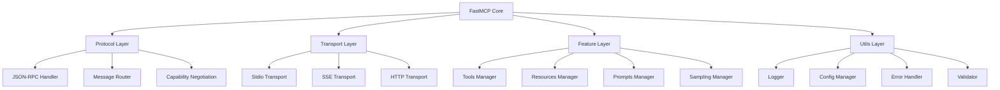

# FastMCP JavaScript版本技术可行性分析

## 1. FastMCP项目功能分析

### 1.1 FastMCP核心功能概述

基于对FastMCP Python项目的分析，FastMCP是一个高级框架，用于构建Model Context Protocol (MCP)服务器和客户端。<mcreference link="https://gofastmcp.com/" index="0">0</mcreference> 其核心功能包括：

**核心特性：**
- **工具定义 (Tools)**：允许LLM执行代码或产生副作用的功能，类似于POST端点
- **资源暴露 (Resources)**：向LLM提供数据的功能，类似于GET端点
- **提示模板 (Prompts)**：可重用的LLM交互模板
- **采样功能 (Sampling)**：服务器发起的代理行为和递归LLM交互

**高级功能：**
- 部署和认证系统
- 客户端库
- 服务器代理和组合
- 从REST API生成服务器
- 动态工具重写
- 内置测试工具
- 与主要AI平台的集成
- 生产就绪的基础设施模式

### 1.2 MCP协议技术规范

Model Context Protocol是一个开放协议，用于标准化应用程序向LLM提供上下文的方式。<mcreference link="https://modelcontextprotocol.io/specification/2025-03-26" index="1">1</mcreference> 协议的核心特征：

- **通信协议**：基于JSON-RPC 2.0消息格式
- **连接模式**：有状态连接
- **能力协商**：服务器和客户端能力协商机制
- **传输方式**：支持stdio、Server-Sent Events (SSE)、Streamable HTTP等

**架构组件：**
- **Hosts**：发起连接的LLM应用程序
- **Clients**：主机应用程序内的连接器
- **Servers**：提供上下文和功能的服务

## 2. JavaScript实现技术可行性评估

### 2.1 可行性评估结果：**高度可行**

基于分析，实现JavaScript版本的FastMCP具有很高的可行性，主要原因：

1. **官方TypeScript SDK存在**：Anthropic已经提供了完整的TypeScript SDK <mcreference link="https://github.com/modelcontextprotocol/typescript-sdk" index="1">1</mcreference>
2. **成熟的生态系统**：已有多个TypeScript MCP服务器实现案例
3. **JavaScript生态优势**：丰富的npm包生态系统和异步处理能力
4. **跨平台支持**：Node.js的跨平台特性

### 2.2 技术优势分析

**JavaScript/TypeScript的优势：**
- **异步处理**：原生Promise和async/await支持，适合I/O密集型操作
- **JSON原生支持**：与JSON-RPC 2.0协议完美匹配
- **丰富的生态系统**：npm包管理器提供大量可用库
- **快速开发**：动态语言特性支持快速原型开发
- **社区活跃**：大量开发者熟悉JavaScript/TypeScript

**现有TypeScript SDK功能：**
- 完整的MCP协议实现
- 多种传输方式支持（stdio、SSE、HTTP）
- 类型安全的API设计
- 资源、工具、提示的完整支持
- 动态服务器功能

## 3. 需要实现的核心功能列表

### 3.1 基础协议层
- [ ] JSON-RPC 2.0消息处理
- [ ] 连接生命周期管理
- [ ] 能力协商机制
- [ ] 错误处理和报告
- [ ] 进度跟踪
- [ ] 取消操作支持

### 3.2 传输层
- [ ] stdio传输支持
- [ ] Server-Sent Events (SSE)传输
- [ ] Streamable HTTP传输
- [ ] WebSocket传输（可选）

### 3.3 核心功能模块
- [ ] **工具系统 (Tools)**
  - 工具注册和发现
  - 参数验证（基于JSON Schema）
  - 工具执行和结果返回
  - 动态工具生成

- [ ] **资源系统 (Resources)**
  - 静态资源暴露
  - 动态资源模板
  - 资源内容读取
  - MIME类型支持

- [ ] **提示系统 (Prompts)**
  - 提示模板定义
  - 参数化提示
  - 提示列表和获取

- [ ] **采样功能 (Sampling)**
  - LLM采样请求处理
  - 上下文管理
  - 递归交互支持

### 3.4 高级功能
- [ ] **服务器组合**：多个MCP服务器的组合和代理
- [ ] **认证系统**：API密钥、OAuth等认证方式
- [ ] **配置管理**：环境变量、配置文件支持
- [ ] **日志系统**：结构化日志和调试支持
- [ ] **测试框架**：单元测试和集成测试工具
- [ ] **部署工具**：Docker、云平台部署支持

### 3.5 开发者体验
- [ ] **装饰器API**：类似Python的@mcp.tool装饰器
- [ ] **类型安全**：完整的TypeScript类型定义
- [ ] **文档生成**：自动API文档生成
- [ ] **调试工具**：MCP Inspector集成
- [ ] **CLI工具**：项目初始化和管理工具

## 4. 技术架构设计建议

### 4.1 整体架构



### 4.2 核心类设计

```typescript
// 核心服务器类
class FastMCP {
  private server: McpServer;
  private transports: Map<string, Transport>;
  private tools: Map<string, Tool>;
  private resources: Map<string, Resource>;
  
  constructor(name: string, options?: FastMCPOptions);
  
  // 装饰器风格的API
  tool(name: string, schema: ToolSchema): MethodDecorator;
  resource(uri: string, options?: ResourceOptions): MethodDecorator;
  prompt(name: string, template: PromptTemplate): MethodDecorator;
  
  // 程序化API
  registerTool(name: string, handler: ToolHandler, schema: ToolSchema): void;
  registerResource(uri: string, handler: ResourceHandler): void;
  registerPrompt(name: string, handler: PromptHandler): void;
  
  // 生命周期
  async run(transport?: TransportType): Promise<void>;
  async stop(): Promise<void>;
}

// 工具定义
interface ToolHandler {
  (params: any): Promise<ToolResult>;
}

interface ToolSchema {
  description: string;
  inputSchema: JSONSchema;
  outputSchema?: JSONSchema;
}

// 资源定义
interface ResourceHandler {
  (uri: string, params?: any): Promise<ResourceContent>;
}
```

### 4.3 模块化设计

**核心模块结构：**
```
fastmcp/
├── src/
│   ├── core/
│   │   ├── server.ts          # 核心服务器实现
│   │   ├── transport/         # 传输层实现
│   │   ├── protocol/          # 协议层实现
│   │   └── features/          # 功能模块
│   ├── decorators/            # 装饰器实现
│   ├── utils/                 # 工具函数
│   ├── types/                 # 类型定义
│   └── index.ts              # 主入口
├── examples/                  # 示例代码
├── docs/                     # 文档
└── tests/                    # 测试
```

### 4.4 依赖管理

**核心依赖：**
- `@modelcontextprotocol/sdk`: 官方MCP SDK
- `zod`: 运行时类型验证
- `reflect-metadata`: 装饰器元数据支持
- `winston`: 日志系统
- `dotenv`: 环境变量管理

**开发依赖：**
- `typescript`: TypeScript编译器
- `jest`: 测试框架
- `eslint`: 代码检查
- `prettier`: 代码格式化

## 5. 实现难点和解决方案

### 5.1 主要技术挑战

#### 5.1.1 装饰器系统实现
**挑战**：Python的装饰器语法在JavaScript中需要特殊处理

**解决方案**：
- 使用TypeScript装饰器（实验性功能）
- 提供函数式API作为备选
- 利用reflect-metadata存储元数据

```typescript
// 装饰器实现示例
function tool(name: string, schema: ToolSchema) {
  return function (target: any, propertyKey: string, descriptor: PropertyDescriptor) {
    Reflect.defineMetadata('mcp:tool', { name, schema }, target, propertyKey);
    return descriptor;
  };
}
```

#### 5.1.2 类型安全保证
**挑战**：确保运行时类型安全和编译时类型检查

**解决方案**：
- 使用Zod进行运行时验证
- 提供完整的TypeScript类型定义
- 自动生成类型从JSON Schema

```typescript
import { z } from 'zod';

const ToolInputSchema = z.object({
  a: z.number(),
  b: z.number()
});

type ToolInput = z.infer<typeof ToolInputSchema>;
```

#### 5.1.3 异步操作管理
**挑战**：复杂的异步操作和错误处理

**解决方案**：
- 使用async/await模式
- 实现超时和取消机制
- 提供统一的错误处理

```typescript
class AsyncOperationManager {
  private operations = new Map<string, AbortController>();
  
  async execute<T>(id: string, operation: () => Promise<T>, timeout?: number): Promise<T> {
    const controller = new AbortController();
    this.operations.set(id, controller);
    
    try {
      if (timeout) {
        setTimeout(() => controller.abort(), timeout);
      }
      
      return await operation();
    } finally {
      this.operations.delete(id);
    }
  }
  
  cancel(id: string): void {
    this.operations.get(id)?.abort();
  }
}
```

### 5.2 性能优化策略

#### 5.2.1 内存管理
- 实现资源池化
- 使用WeakMap避免内存泄漏
- 定期清理未使用的资源

#### 5.2.2 并发处理
- 使用Worker Threads处理CPU密集型任务
- 实现请求队列和限流
- 优化JSON序列化/反序列化

### 5.3 兼容性考虑

#### 5.3.1 Node.js版本支持
- 最低支持Node.js 18.x
- 使用条件导入支持不同版本
- 提供polyfill支持旧版本

#### 5.3.2 浏览器支持
- 提供浏览器兼容版本
- 使用Web Workers替代Worker Threads
- 实现WebSocket传输支持

## 6. 开发路线图

### 6.1 第一阶段：核心功能 (4-6周)
- [ ] 基础协议层实现
- [ ] stdio传输支持
- [ ] 基本工具和资源系统
- [ ] 简单的装饰器API

### 6.2 第二阶段：完整功能 (6-8周)
- [ ] 所有传输方式支持
- [ ] 完整的功能模块
- [ ] 高级装饰器系统
- [ ] 测试框架和文档

### 6.3 第三阶段：生态系统 (8-10周)
- [ ] CLI工具开发
- [ ] 部署和监控工具
- [ ] 社区集成和示例
- [ ] 性能优化和稳定性改进

## 7. 结论

基于详细的技术分析，**实现JavaScript版本的FastMCP项目具有很高的可行性**。主要优势包括：

1. **技术基础扎实**：官方TypeScript SDK提供了坚实的基础
2. **生态系统成熟**：JavaScript/Node.js生态系统非常适合这类项目
3. **市场需求明确**：MCP协议正在快速普及，JavaScript版本将填补重要空白
4. **实现路径清晰**：可以基于现有SDK进行高级封装和优化

**建议的实施策略：**
- 采用渐进式开发方法，先实现核心功能
- 重点关注开发者体验和易用性
- 建立完善的测试和文档体系
- 积极参与MCP社区，确保兼容性和标准化

通过实现FastMCP JavaScript版本，可以为JavaScript开发者提供一个强大、易用的MCP开发框架，推动MCP生态系统的进一步发展。