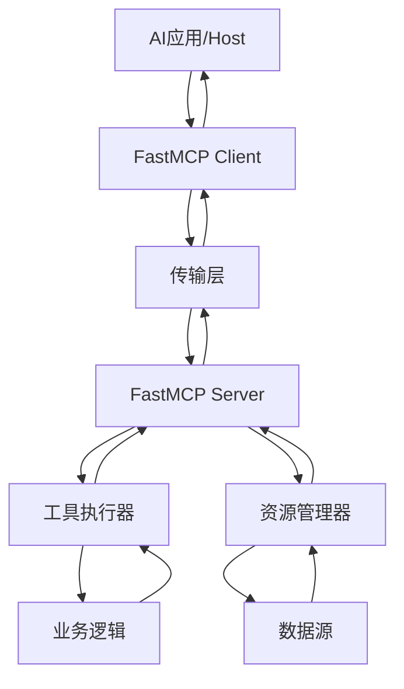

# FastMCP JavaScript版本产品需求文档

## 1. 产品概述

FastMCP JavaScript版本是一个高级框架，用于构建Model Context Protocol (MCP)服务器和客户端，为JavaScript/TypeScript开发者提供简单、直观的API来创建AI应用的上下文连接器。

该产品旨在解决JavaScript生态系统中缺乏高级MCP开发框架的问题，让开发者能够快速构建连接AI应用与数据源的桥梁，推动MCP生态系统在JavaScript社区的普及和发展。

产品目标是成为JavaScript开发者构建MCP服务器的首选框架，提供与Python版本FastMCP相当的功能和开发体验。

## 2. 核心功能

### 2.1 用户角色

| 角色 | 使用场景 | 核心权限 |
|------|----------|----------|
| JavaScript开发者 | 构建MCP服务器，集成现有系统 | 使用所有API，创建工具和资源 |
| AI应用开发者 | 集成MCP客户端到AI应用中 | 使用客户端API，连接MCP服务器 |
| 企业开发团队 | 构建企业级MCP解决方案 | 使用高级功能，部署和监控工具 |

### 2.2 功能模块

我们的FastMCP JavaScript版本包含以下主要功能模块：

1. **核心服务器模块**：MCP服务器创建、配置和生命周期管理
2. **工具系统模块**：工具注册、执行和管理功能
3. **资源系统模块**：数据资源暴露和访问控制
4. **传输层模块**：多种传输协议支持（stdio、SSE、HTTP）
5. **装饰器API模块**：简化的装饰器风格API
6. **客户端模块**：MCP客户端连接和通信功能
7. **开发工具模块**：调试、测试和部署工具

### 2.3 页面详情

| 功能模块 | 子功能 | 功能描述 |
|----------|--------|----------|
| 核心服务器模块 | 服务器初始化 | 创建FastMCP服务器实例，配置基本参数（名称、版本、能力） |
| 核心服务器模块 | 生命周期管理 | 启动、停止、重启服务器，处理连接状态变化 |
| 核心服务器模块 | 能力协商 | 与客户端协商支持的功能和协议版本 |
| 工具系统模块 | 工具注册 | 通过装饰器或程序化API注册工具函数 |
| 工具系统模块 | 参数验证 | 基于JSON Schema验证工具输入参数 |
| 工具系统模块 | 工具执行 | 安全执行工具函数，处理异步操作和错误 |
| 工具系统模块 | 动态工具 | 运行时动态创建和修改工具定义 |
| 资源系统模块 | 静态资源 | 暴露固定的数据资源（文件、配置等） |
| 资源系统模块 | 动态资源 | 基于参数动态生成资源内容 |
| 资源系统模块 | 资源模板 | 支持URI模板和参数化资源访问 |
| 资源系统模块 | 内容类型 | 支持多种MIME类型（文本、JSON、二进制等） |
| 传输层模块 | Stdio传输 | 通过标准输入输出进行通信 |
| 传输层模块 | SSE传输 | Server-Sent Events传输支持 |
| 传输层模块 | HTTP传输 | RESTful HTTP API传输 |
| 传输层模块 | WebSocket传输 | 实时双向通信支持 |
| 装饰器API模块 | @tool装饰器 | 简化工具函数定义和注册 |
| 装饰器API模块 | @resource装饰器 | 简化资源处理器定义 |
| 装饰器API模块 | @prompt装饰器 | 简化提示模板定义 |
| 装饰器API模块 | 元数据管理 | 自动收集和管理装饰器元数据 |
| 客户端模块 | 连接管理 | 建立和维护与MCP服务器的连接 |
| 客户端模块 | 请求处理 | 发送请求到服务器并处理响应 |
| 客户端模块 | 错误处理 | 统一的错误处理和重试机制 |
| 开发工具模块 | CLI工具 | 项目初始化、构建和部署命令行工具 |
| 开发工具模块 | 调试支持 | 集成MCP Inspector，提供调试界面 |
| 开发工具模块 | 测试框架 | 单元测试和集成测试工具 |
| 开发工具模块 | 文档生成 | 自动生成API文档和使用指南 |

## 3. 核心流程

### 3.1 开发者使用流程

**服务器开发流程：**
1. 开发者安装FastMCP JavaScript包
2. 创建新的MCP服务器项目
3. 使用装饰器或API定义工具和资源
4. 配置传输方式和服务器参数
5. 启动服务器并测试功能
6. 部署到生产环境

**客户端集成流程：**
1. AI应用开发者集成FastMCP客户端
2. 配置连接到目标MCP服务器
3. 发现可用的工具和资源
4. 在AI交互中调用工具和获取资源
5. 处理响应和错误情况

### 3.2 系统交互流程

## 4. 用户界面设计

### 4.1 设计风格

**API设计风格：**
- **主色调**：专业的深蓝色 (#1e3a8a) 和现代绿色 (#10b981)
- **代码风格**：简洁的装饰器语法，链式API调用
- **字体**：等宽字体用于代码示例，无衬线字体用于文档
- **布局风格**：模块化设计，清晰的层次结构
- **图标风格**：简约的线性图标，统一的视觉语言

### 4.2 API设计概览

| 功能模块 | API风格 | 设计元素 |
|----------|---------|----------|
| 服务器初始化 | 构造函数模式 | 简洁的配置对象，链式方法调用 |
| 装饰器API | Python风格装饰器 | @tool, @resource, @prompt装饰器 |
| 程序化API | 函数式编程 | register*方法，回调函数模式 |
| 类型定义 | TypeScript接口 | 完整的类型安全，自动补全支持 |
| 错误处理 | 统一异常类 | 结构化错误信息，错误码分类 |
| 配置管理 | 对象配置 | 环境变量支持，配置验证 |
| 日志系统 | 结构化日志 | 不同级别日志，JSON格式输出 |

### 4.3 响应式设计

该产品主要面向服务器端开发，不涉及传统的响应式UI设计。但在API设计上考虑了以下响应式特性：

- **自适应传输**：根据环境自动选择最适合的传输方式
- **动态配置**：支持运行时配置修改和热重载
- **弹性扩展**：支持水平扩展和负载均衡
- **容错处理**：自动重试、降级和故障恢复机制

## 5. 技术规格

### 5.1 系统要求

**运行环境：**
- Node.js 18.x 或更高版本
- TypeScript 5.0+ （开发时）
- 支持ES2022语法特性

**依赖要求：**
- 核心依赖：@modelcontextprotocol/sdk, zod, reflect-metadata
- 可选依赖：winston (日志), dotenv (配置)
- 开发依赖：typescript, jest, eslint, prettier

### 5.2 性能指标

**性能目标：**
- 工具执行延迟：< 100ms (简单工具)
- 资源访问延迟：< 50ms (缓存资源)
- 并发连接数：> 1000 (单实例)
- 内存使用：< 100MB (基础配置)
- CPU使用率：< 10% (空闲状态)

### 5.3 安全要求

**安全特性：**
- 输入验证：所有用户输入必须经过JSON Schema验证
- 权限控制：基于角色的访问控制 (RBAC)
- 传输安全：支持TLS/SSL加密传输
- 认证机制：API密钥、JWT令牌认证
- 审计日志：完整的操作审计和访问日志

### 5.4 兼容性要求

**协议兼容性：**
- 完全兼容MCP协议规范
- 向后兼容旧版本客户端
- 支持协议版本协商

**平台兼容性：**
- 跨平台支持：Windows, macOS, Linux
- 容器化支持：Docker, Kubernetes
- 云平台支持：AWS, Azure, GCP

## 6. 质量保证

### 6.1 测试策略

**测试类型：**
- 单元测试：覆盖率 > 90%
- 集成测试：端到端功能测试
- 性能测试：负载和压力测试
- 兼容性测试：多版本Node.js测试

**测试工具：**
- Jest：单元测试框架
- Supertest：HTTP API测试
- MCP Inspector：协议兼容性测试

### 6.2 文档要求

**文档类型：**
- API参考文档：完整的API说明和示例
- 快速入门指南：5分钟上手教程
- 最佳实践指南：生产环境部署建议
- 故障排除指南：常见问题和解决方案

### 6.3 发布计划

**版本规划：**
- v0.1.0：核心功能MVP版本
- v0.5.0：完整功能Beta版本
- v1.0.0：生产就绪稳定版本
- v1.x.x：功能增强和优化版本

**发布周期：**
- 主版本：6个月
- 次版本：2个月
- 补丁版本：按需发布

## 7. 成功指标

### 7.1 技术指标

- **功能完整性**：实现Python版本90%以上的功能
- **性能表现**：响应时间优于现有解决方案20%
- **稳定性**：99.9%的运行时间可用性
- **兼容性**：支持所有主流MCP客户端

### 7.2 用户指标

- **采用率**：6个月内获得1000+开发者使用
- **社区活跃度**：GitHub星标数 > 500
- **文档质量**：用户满意度 > 4.5/5
- **问题解决**：平均问题响应时间 < 24小时

### 7.3 生态系统指标

- **集成数量**：与10+主流AI工具集成
- **示例项目**：提供20+实用示例
- **第三方包**：社区贡献的扩展包 > 5个
- **企业采用**：至少3家企业在生产环境使用